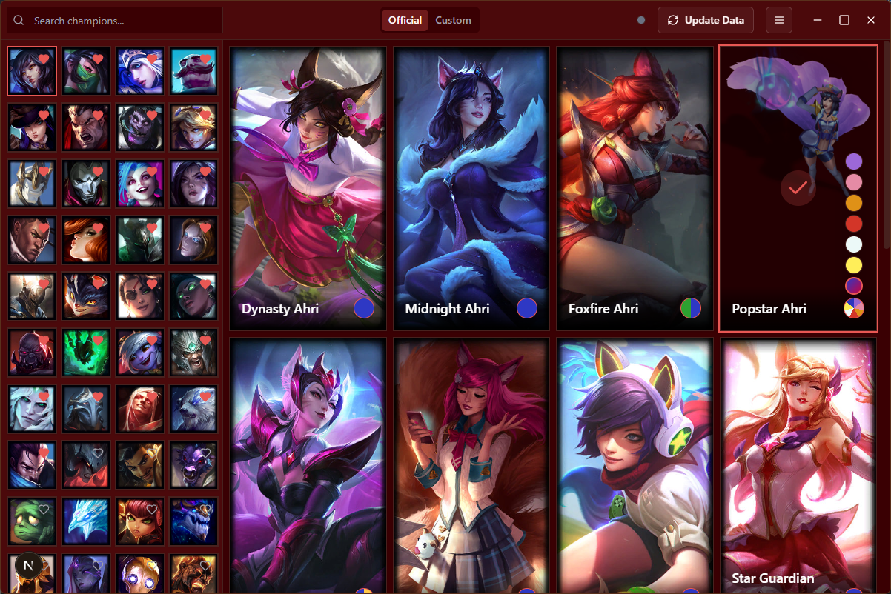

# Osskins

A cross‑platform desktop application built with Next.js, Tauri and TypeScript. Osskinns lets you browse, search and manage custom skins for League of Legends on Windows.

## Key Features

- **Tauri + Next.js**  
  Combines Tauri’s lightweight Rust backend and secure webview with Next.js App Router (v15) and Static Site Generation.
- **TypeScript & React**  
  Fully typed frontend with React 19, Zustand for state, and next-themes for dark/light mode.
- **TailwindCSS v4**  
  Utility‑first styling, customizable via Tailwind config.
- **Headless UI & Radix**  
  Accessible dialogs, menus, tooltips and more from @radix‑ui/react.
- **Modular Architecture**
  - `src/components` contains UI primitives and domain components.
  - `src/hooks` and `src/lib` for data fetching, local persistence and utilities.
  - `src-tauri/src` houses all Rust logic and Tauri commands.
- **Notifications & Feedback**  
  In-app toasts via Sonner, progress bars, status indicators and logs dialog.

## Prerequisites

- Node.js ≥18 & pnpm
- Rust toolchain (`rustup`, `cargo`)
- Windows 10+ (for Tauri’s native window)

## Development

- Install deps: `pnpm install`
- Run dev (auto-prepares bundled tools): `pnpm tauri dev`

If you need to run the tools preparation step manually:

- `pnpm prepare:cslol-tools`

## CSLoL Tools (bundled)

This project bundles the CSLoL helper tools locally instead of downloading them at runtime.

- Source archive: [src-tauri/resources/cslol-tools.zip](src-tauri/resources/cslol-tools.zip)
- Extracted (generated) directory: [src-tauri/resources/cslol-tools](src-tauri/resources/cslol-tools)

Because one of the files is very large (e.g. `hashes.game.txt`), the extracted directory is not meant to be committed to git. Instead, the archive is committed and the folder is extracted automatically:

- On `tauri dev`: via `beforeDevCommand` in [src-tauri/tauri.conf.json](src-tauri/tauri.conf.json)
- On `tauri build`: via `beforeBuildCommand` in [src-tauri/tauri.conf.json](src-tauri/tauri.conf.json)

If you update any tool files, regenerate the archive and keep the extracted folder out of git:

- Rebuild archive: `pnpm prepare:cslol-tools` (and re-create the zip if you changed inputs)
